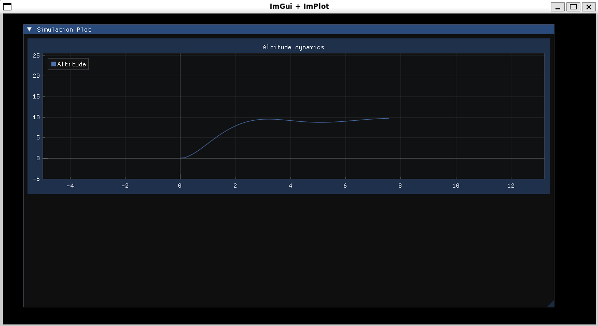

# Description
Simple example of PID controller in C++.
PID used in simple aircraft 1D simulation (altitude only) to achieve desired altitude from point of start (0 altitude).

# How to run

Install GLFW (if not installed):

```bash
sudo apt install libglfw3-dev
```

#### Simulation:
```bash
make           # Builds the project
./bin/exec     # Runs the executable
```

#### Clean:
```bash
make clean     # Cleans up build files
```
# Settings
In file settings.txt you can modify simulation parameters.
- dt (default 0.05) - Time step of simulation, s
- simulation_time (default 100) - Total time of simulation, s
- gravity (default 9.81) - g value for simulation in m/s^2
- drag_coefficient (default 0.1) - drag coefficient for simulation, Newtons
- target_altitude (default 10) - desired altitude, m
- pid_kp - PID parameter: Proportional gain
- pid_ki - PID parameter: Integral gain
- pid_kd - PID parameter: Derivative gain
- pid_integral_err_min - PID parameter: Lower bound for integral error
- pid_integral_err_max - PID parameter: Upper bound for integral error
- aircraft_mass - Aircraft parameter: mass, kg
- aircraft_min_thrust - Aircraft parameter: minimal thrust, Neutons
- aircraft_max_thrust - Aircraft parameter: max thrust, Neutons

# Example
Terminal:
```terminal
Running
Reading the settings.
dt: 0.01
simulation_time: 10
gravity: 9.81
drag_coefficient: 0.1
target_altitude: 10
pid_kp: 2
pid_ki: 0.5
pid_kd: 1
aircraft_mass: 1
aircraft_min_thrust: 0
aircraft_max_thrust: 30
Settings are loaded.
Trust (PID): 20.05 Trust (real): 20.05 Alt: 0.001024
Trust (PID): 19.9955 Trust (real): 19.9955 Alt: 0.00306645
Trust (PID): 19.9396 Trust (real): 19.9396 Alt: 0.00612144
Trust (PID): 19.8822 Trust (real): 19.8822 Alt: 0.0101827
Trust (PID): 19.8234 Trust (real): 19.8234 Alt: 0.0152437
Trust (PID): 19.7632 Trust (real): 19.7632 Alt: 0.0212974
Trust (PID): 19.7017 Trust (real): 19.7017 Alt: 0.0283367
Trust (PID): 19.639 Trust (real): 19.639 Alt: 0.0363539
Trust (PID): 19.575 Trust (real): 19.575 Alt: 0.0453411
Trust (PID): 19.5098 Trust (real): 19.5098 Alt: 0.0552903
Trust (PID): 19.4434 Trust (real): 19.4434 Alt: 0.0661929
Trust (PID): 19.3759 Trust (real): 19.3759 Alt: 0.0780402
Trust (PID): 19.3074 Trust (real): 19.3074 Alt: 0.0908232
Trust (PID): 19.2378 Trust (real): 19.2378 Alt: 0.104533
Trust (PID): 19.1672 Trust (real): 19.1672 Alt: 0.119159
Trust (PID): 19.0956 Trust (real): 19.0956 Alt: 0.134692
...
Trust (PID): 8.05727 Trust (real): 8.05727 Alt: 9.47374
Trust (PID): 8.07602 Trust (real): 8.07602 Alt: 9.47427
Trust (PID): 8.09493 Trust (real): 8.09493 Alt: 9.47463
Trust (PID): 8.11399 Trust (real): 8.11399 Alt: 9.47482
Trust (PID): 8.1332 Trust (real): 8.1332 Alt: 9.47485
Trust (PID): 8.15255 Trust (real): 8.15255 Alt: 9.4747
Trust (PID): 8.17203 Trust (real): 8.17203 Alt: 9.4744
^C
Caught signal 2 (SIGINT). Exiting safely...
Execution is finished
```
Plot:


# Credits

This project uses the following open-source libraries:

- [Dear ImGui](https://github.com/ocornut/imgui) - MIT License
- [ImPlot](https://github.com/epezent/implot) - MIT License
- [GLFW](https://www.glfw.org/) - zlib/libpng License
- [OpenGL](https://www.opengl.org/) - Open Standard

I would like to thank the authors of these projects for their contributions to open-source software.
